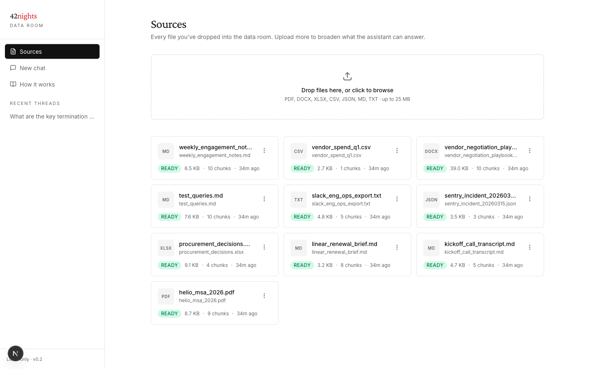
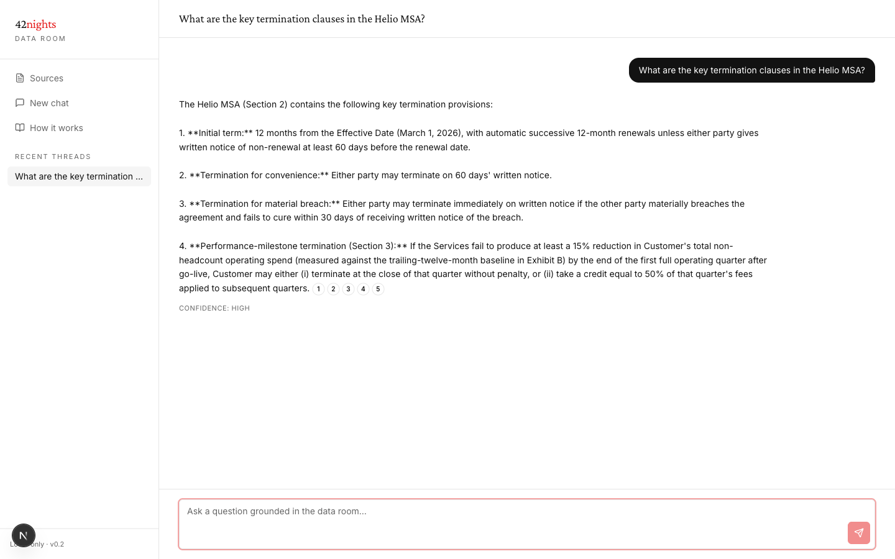
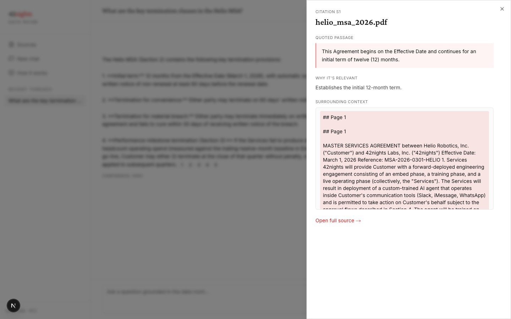
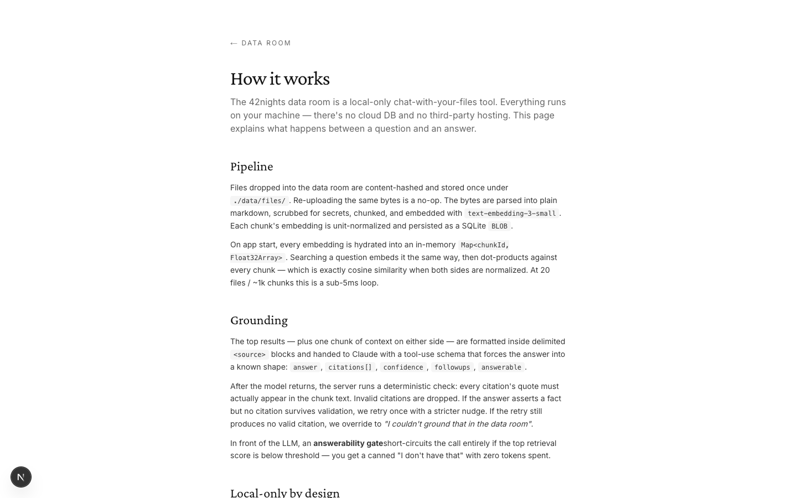

# Dataroom · by 42nights Inc.

The internal data room the 42nights team runs on — drop in customer contracts, call transcripts, Slack exports, and procurement playbooks, then ask questions and get answers grounded *only* in the corpus, with verbatim citations back to the source.

Local-only by design. No cloud DB, no Convex, no Vercel. One `npm run dev` and the whole app is at `localhost:3000`. State lives in `./data/dataroom.db` and `./data/files/`.



## What's in the box

- **Hand-rolled RAG.** No `@convex-dev/rag`, no Pinecone, no LanceDB. SQLite for storage, an in-memory `Map<chunkId, Float32Array>` for the index, dot-product cosine because every embedding is unit-normalized. Sub-5ms search at ≤1k chunks.
- **OpenAI embeddings** (`text-embedding-3-small`, 1536d) + **Anthropic Claude Opus 4.7** for generation with tool-use schema.
- **Citation validator** — every quote the model returns must appear verbatim in the chunk it cites. Invalid citations get dropped on the floor. If a fact-asserting answer ends up with zero valid citations after a stricter retry, we override to *"I couldn't ground that in the data room."*
- **Answerability gate** in front of the LLM — if top retrieval score is below threshold, return a canned "I don't have that" with **zero tokens spent**.
- **Secret scrubber** server-side: Anthropic / OpenAI / GitHub / AWS / Stripe / Slack / PEM / JWT patterns redacted before anything hits an embedding or generation API.
- **Parsers:** PDF (`pdfjs-dist`), DOCX (`mammoth`), XLSX (`xlsx`), CSV (`papaparse`), JSON, MD, TXT.

## Stack

- Next.js 16 (App Router, Turbopack), React 19, TypeScript strict, Tailwind 3
- shadcn-style primitives (button, dialog, dropdown, badge, input, textarea), `sonner` for toasts, `lucide-react` for icons
- `better-sqlite3` for the DB (a single file at `./data/dataroom.db`)
- `@anthropic-ai/sdk` for generation, raw `fetch` for OpenAI embeddings
- `vitest` for tests (20 unit tests covering chunker, scrubber, citations, parsers, vector math)
- Inter (body) + Crimson Pro (display) + JetBrains Mono (code)

## Start

```bash
nvm use                                  # node 22+
npm install
cp .env.local.example .env.local         # paste your OpenAI + Anthropic keys
npm run dev                              # next dev on :3000
```

The schema migrates itself on the first API request. To wipe everything: `rm -rf data/`.

```bash
npm test                                 # 20 vitest cases
npm run typecheck                        # tsc --noEmit
npm run build                            # Turbopack production build
npm run reingest:stale                   # re-embed any docs whose prompt_version is out of date
```

## Architecture

```
   Browser ──fetch──▶ Next.js API routes ──▶ lib/ingest, lib/search
                            │
                            ▼
                  better-sqlite3 ──▶ ./data/dataroom.db
                            │
                            ▼
              In-memory Map<chunkId, Float32Array>
              (hydrated from chunks.embedding on first import)
                            │
                            ▼
       api.openai.com (embeddings) · api.anthropic.com (generation)
```

The only network calls this app makes are to those two endpoints. No analytics, no telemetry, no third-party DB.

### Ask a question



Every numbered chip is a validated citation — click one for the verbatim quote, why-it's-relevant context, and the surrounding chunks pulled from disk.



### Methodology lives in the product

The `/how-it-works` page documents what's actually happening between a question and an answer, including the answerability gate and the deterministic citation validator. Same tone as Lightyear's transparency page.



## File layout

```
lib/
├─ db/                  schema.sql · better-sqlite3 singleton · ensureSchema()
├─ parsers/             pdf · docx · xlsx · csv · json · plain · markdown
├─ chunker.ts           markdown-aware splitter (tables stay whole, soft overlap)
├─ scrubber.ts          secret patterns → [REDACTED:<kind>]
├─ citations.ts         zod schema + Anthropic tool spec + validateCitations()
├─ prompts.ts           versioned system prompt + stricter-retry nudge
├─ embeddings.ts        OpenAI batch embed + normalize()
├─ vector.ts            in-memory index · insert/delete · searchByVector · getChunkWithContext
├─ ingest.ts            parse → scrub → chunk → embed → store (transactional)
├─ search.ts            retrieve → gate → tool-use → validate → retry
├─ chat-db.ts           thread + message CRUD
├─ anthropic.ts         thin client wrapper
├─ audit.ts             append-only audit_log
└─ api-client.ts        browser-side fetch helpers

app/
├─ sources/             list, upload, detail
├─ chat/[threadId]/     threaded chat with citation chips
├─ how-it-works/        methodology page
├─ unlock/              optional passcode form (only used when APP_PASSCODE is set)
└─ api/
   ├─ upload/                              POST multipart
   ├─ sources/[id]/chunks/[idx]/           citation preview
   ├─ chat/threads/[id]/messages/          message list
   └─ chat/                                send + answer
```

## Env

| Variable | Purpose |
|---|---|
| `OPENAI_API_KEY` | Embeddings via `text-embedding-3-small` |
| `ANTHROPIC_API_KEY` | Generation via Claude Opus 4.7 with tool-use |
| `APP_PASSCODE` | Optional. If set, the whole app gates behind a single-field passcode at `/unlock`. Unset = bypass. |

## Pipeline detail

1. **Upload** (`POST /api/upload`) — content-hashes the bytes (SHA-256), dedupes against existing rows. Identical bytes return the existing `documentId` with `deduped: true` and skip every downstream step.
2. **Parse** (`lib/parsers/`) — per-mime dispatch to plain markdown. Tables in XLSX/CSV become real markdown tables.
3. **Scrub** (`lib/scrubber.ts`) — server-side regex sweep redacts API keys, PATs, AWS access keys, Stripe keys, Slack tokens, PEM private keys, JWTs. Logged but not blocked.
4. **Chunk** (`lib/chunker.ts`) — markdown-aware: splits on headings, keeps tables whole up to a hard cap, soft overlap between chunks so context survives boundaries. Defaults: 200/1200/100/4000.
5. **Embed** (`lib/embeddings.ts`) — batched against OpenAI (96 per request). Every vector unit-normalized on receive.
6. **Index** (`lib/vector.ts`) — inserted into both SQLite (`chunks.embedding` as a `BLOB`) and the in-memory `Map<chunkId, Float32Array>`. Status flips to `ready`.
7. **Query** (`POST /api/chat`) — embed the question → dot-product against the in-memory map → top-K → answerability gate. If the gate passes, build `<source id="Sn">` blocks (with one chunk of context on either side) and call Claude with tool-use forcing the answer into a shape with citations, confidence, follow-ups, and `answerable`.
8. **Validate** — every cited quote must appear verbatim (whitespace-normalized) in the chunk it points at. Invalid citations dropped. Fact-asserting answer with zero validated citations → one stricter-retry → if still zero, force `answerable: false`.
9. **Persist** — append assistant message with validated `citations`, `followups`, `confidence`, `prompt_version`. Audit row written for every ask.

## Caveats

- No streaming — answers complete in a single tool-use call (4–10s).
- Pure vector search. FTS5 hybrid is sketched in `lib/db/schema.sql` and is a ~30-line follow-up.
- PDFs with complex tables can lose structure under `pdfjs-dist`. A LlamaParse fallback is sketched in the original spec.
- Designed for ≤ 20 files. The in-memory index grows linearly with chunks; past ~10k chunks, swap to `sqlite-vec` or HNSW (~100-line change).
- No GitHub OAuth or member allowlist. Local-only assumes the person at the keyboard is authorized.

## Test surface

```
test/
├─ chunker.test.ts      4 tests — bounds, tables, overlap, empty input
├─ scrubber.test.ts     5 tests — Anthropic/GitHub/AWS/PEM patterns + clean text
├─ citations.test.ts    5 tests — quote-in-chunk validation + fact-detection
├─ parsers.test.ts      4 tests — CSV/JSON/MD/plain text round-trips
└─ vector.test.ts       2 tests — dot-product ordering + delete-syncs-index
```

`npm test` runs all 20 in under a second.

---

*v0.2 · local-only · hand-rolled RAG · grounded answers or none*
